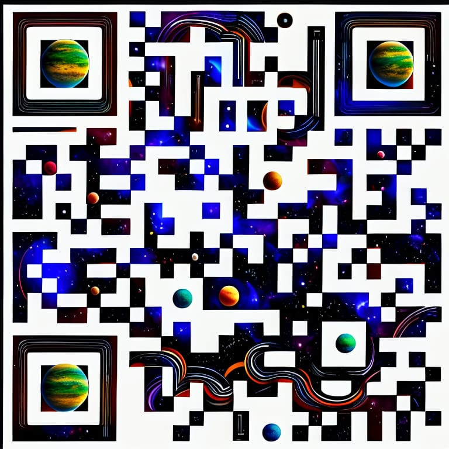
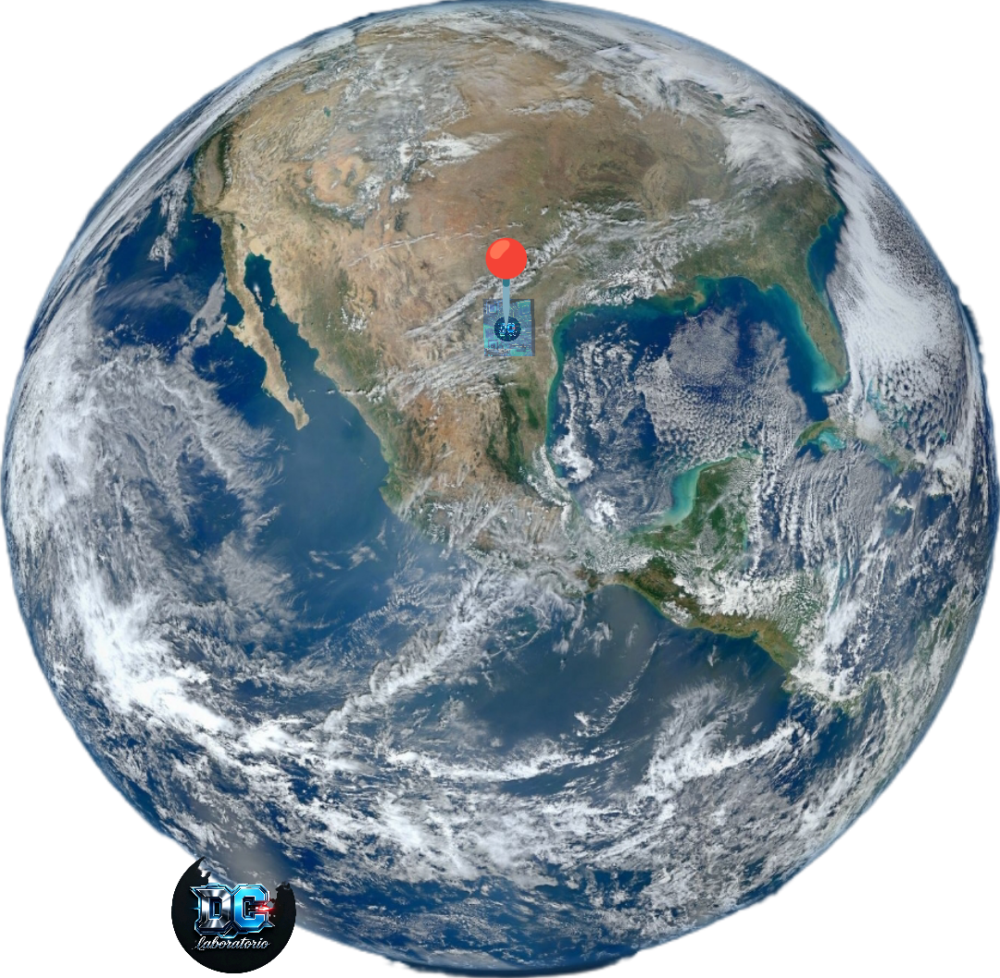

<p align="center">
  
  
</p>


# MONTERREY // NEON EARTH

Experiencia web interactiva con estética cyberpunk para explorar Monterrey Centro mediante un globo planetario visual, capas de datos, modos de visualización y controles de navegación.

## Incluye

- Globo visual con la imagen `assets/planeta.png` tomada del repositorio.
- Marcador de Monterrey Centro alineado con el punto señalado en la textura del planeta.
- Modos Órbita 3D, Satélite y Terreno.
- Capas de red urbana, flujo vehicular y topografía.
- Búsqueda de destino, zoom, seguimiento, telemetría y diseño responsive.

## Desarrollo local

```bash
pnpm install
pnpm dev
```

Para validar tipos y compilar producción:

```bash
pnpm check
pnpm build
```

> La experiencia usa un asset gestionado por WebDev para su preview desplegado. El archivo fuente `assets/planeta.png` se incluye en este repositorio para conservar la imagen original.


## Sitio publicado

La versión desplegada de la experiencia está disponible en:

https://dcg0.github.io/planeta/

El repositorio conserva el código completo de la página, la textura `assets/planeta.png` y los archivos `planeta.png` y `qrplaneta.jpg` añadidos al repo.
